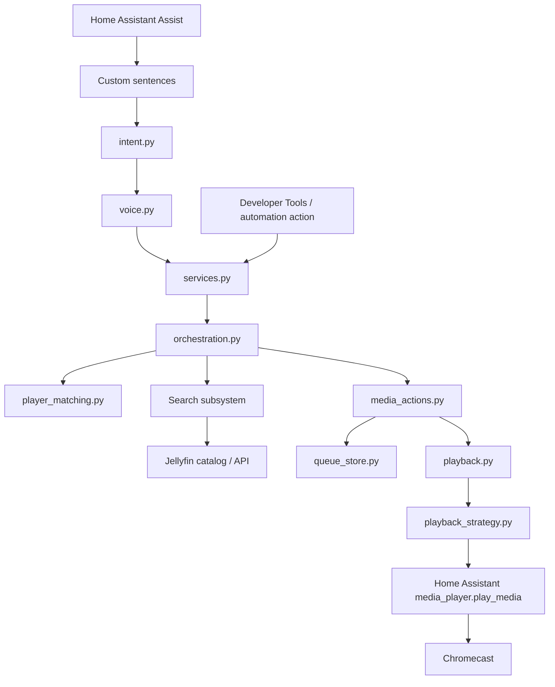
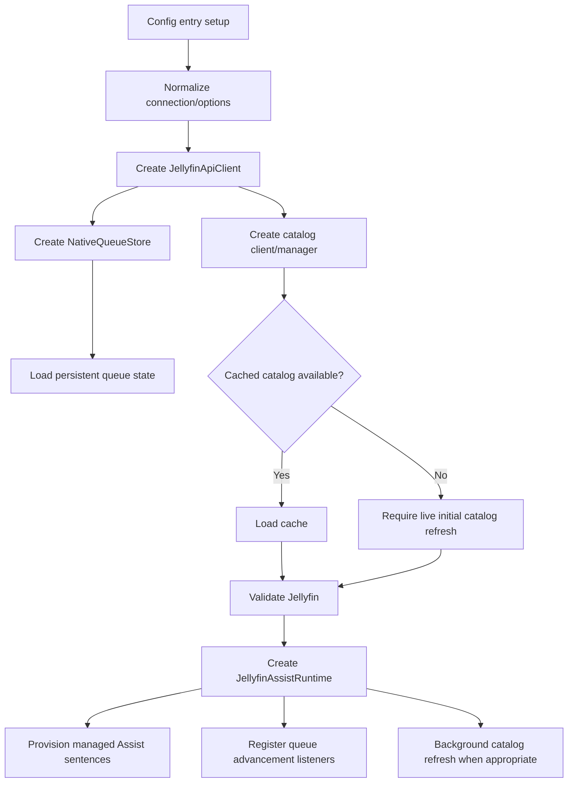
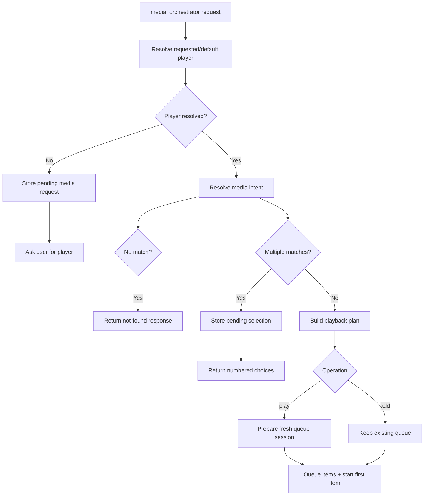
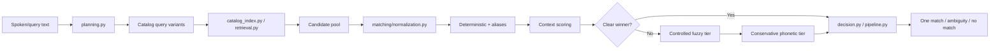
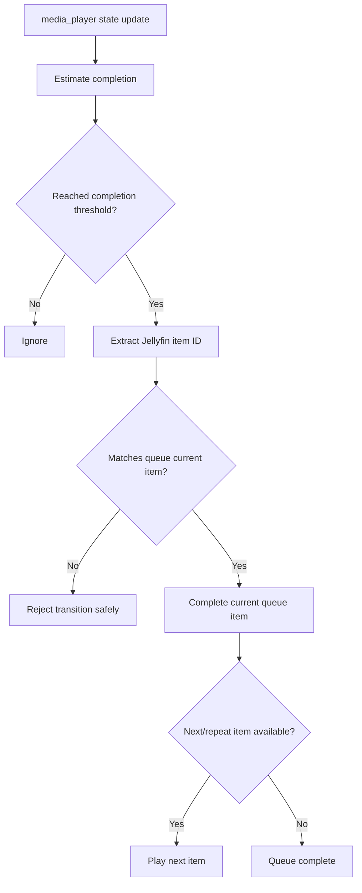

# Architecture

This document describes the current Jellyfin Media Assistant runtime architecture and the ownership boundaries intended to help contributors make targeted changes without reintroducing retired YAML scripts, external queue services, or JellyHA runtime dependencies.

## Design goals

The integration is organized around a few boundaries:

- **Home Assistant owns conversation and media-player entities.**
- **Jellyfin Media Assistant owns Jellyfin search/resolution, queue state, and playback orchestration.**
- **Jellyfin is the source of media metadata and stream/item information.**
- **Home Assistant storage owns persistent integration state.**
- **Player aliases stay in Home Assistant rather than being hard-coded for one installation.**
- **Search matching is deterministic/conservative before it becomes fuzzy or phonetic.**
- **High-level orchestration is separate from low-level services so actions can be tested independently.**

## High-level request flow



Assist is only one entry point. The same core behavior is also exposed as Home Assistant actions registered by `services.py`.

## Integration startup

`custom_components/jellyfin_assist/__init__.py` owns config-entry startup.



`runtime.py` defines the per-config-entry `JellyfinAssistRuntime` object that keeps the active client, catalog manager, queue store, configuration, pending conversation state, and diagnostics state together.

## Voice layer

### Packaged grammar

`custom_components/jellyfin_assist/custom_sentences/en/jellyfin_assist_media.yaml` contains the English Assist grammar.

It routes phrases into 27 native Jellyfin Media Assistant intent types covering:

- play/add for generic media;
- movie, song, album, artist, show/season/episode, and episode-title requests;
- numbered result selection;
- pending-player continuation; and
- next, status/history, clear, shuffle, and repeat queue operations.

### Intent handling

`intent.py` registers Home Assistant intent handlers. Each handler extracts slot values and calls `voice.build_voice_script_call()`.

`voice.py` is deliberately thin. It:

- normalizes spoken slot text;
- separates optional `by <artist>` and `from <series>` context;
- validates numeric selection/season/episode slots; and
- maps the native intent to one canonical integration action.

Most media intents route to `jellyfin_assist.media_orchestrator`; queue intents route to `jellyfin_assist.queue_command`.

### Managed sentence provisioning

`voice_sentences.py` owns installation/update of the runtime sentence file. It tracks the last managed checksum in Home Assistant storage so a user-edited file is preserved rather than overwritten. Repair issues surface conflicts.

## Action/service boundary

`services.py` registers the Home Assistant action surface and resolves a config entry/runtime for each call.

The main public/internal action families are:

| Area | Actions |
|---|---|
| High-level orchestration | `media_orchestrator`, `play_pending_media`, `resume_pending_media_request` |
| Search/item lookup | `search`, `get_item`, `search_season`, `search_episode`, `search_episode_title`, `get_album_tracks`, `get_artist_tracks` |
| Player resolution | `resolve_media_player`, `resume_media_request` |
| Queue | `queue_get`, `queue_add`, `queue_next`, `queue_clear`, `queue_set_repeat`, `queue_shuffle`, `queue_command` |
| Playback | `play_on_chromecast` |
| Recovery | `repair_voice_sentences` |

`services.py` should remain a Home Assistant boundary/adapter rather than becoming the place where search or playback policy lives.

## Media orchestration

`orchestration.py` owns the high-level media request lifecycle.



The resolver may turn one logical result into several playable items:

- **Series/season:** retrieve the selected season's episodes.
- **Specific season+episode:** resolve the series, season, then exact episode.
- **Episode title:** combine episode-title search with optional parent-series context.
- **Music album:** retrieve album tracks.
- **Music artist:** retrieve artist tracks.
- **Movie/song/episode:** normally produce one playable item.

Pending numbered selection and missing-player continuation are stored on the runtime object and resumed through the same orchestration path.

## Search architecture

The search subsystem is split into catalog acquisition/retrieval and matching/ranking.



### Catalog layer (`search/`)

- `jellyfin_client.py` — Jellyfin catalog-query adapter.
- `catalog_loader.py` — paginated snapshot loading and media-type request groups.
- `catalog_cache.py` — sanitized on-disk cache serialization/validation.
- `catalog_manager.py` — live/cache lifecycle and refresh behavior.
- `catalog_index.py` — local shortlist/index structures.
- `planning.py` — conservative query variants and candidate aggregation.
- `retrieval.py` — executes plans and maps catalog records into matcher candidates.
- `items.py` — metadata normalization helpers.
- `response.py` — stable response serialization and diagnostics.

### Matching layer (`matching/`)

- `normalization.py` — Unicode/case/spacing/punctuation/numeric variants.
- `aliases.py` — spoken/stylized numeric aliases.
- `deterministic.py` — exact/equivalent/fragment title matching.
- `context.py` — artist, album, series, year, and media-type evidence.
- `fuzzy.py` — bounded edit/transposition/keyboard-neighbor matching.
- `phonetic.py` — conservative pronunciation fallback.
- `pipeline.py` — combines lexical families, context, thresholds, and ambiguity rules.
- `decision.py` — confidence/decision helpers used by the search family.

A key safety rule is that context refines a title candidate; unrelated context should not manufacture a candidate that the title search did not reasonably find.

## Player resolution

`player_matching.py` resolves spoken player text against the Home Assistant player set supplied by `services.py`.

The integration intentionally does not ship household-specific aliases. Home Assistant friendly names and entity-registry aliases are the configuration source.

When a playback-target allowlist is configured, typo recovery can be more permissive because the candidate universe is bounded. Without an allowlist, resolution stays more conservative.

## Queue model

`queue_store.py` implements the persistent per-player queue. `queue_control.py` exposes conversational operations over that store.

Conceptually, each player has:

```text
current_index
queue[]
previous / last_completed
repeat_item
repeat_queue
```

Derived response fields include current, next, upcoming items, position, and counts.

The store is backed by Home Assistant's `Store` helper using an entry-specific storage key. Mutations are serialized by an async lock and saved atomically by Home Assistant.

### Queue command layer

`queue_control.py` implements user-facing semantics for:

- what's playing;
- what just played;
- queue status;
- clear;
- shuffle upcoming items while preserving the current item;
- next; and
- repeat-item/repeat-queue enable, disable, and toggle behavior.

## Automatic advancement

`advancement.py` listens to state changes for configured playback targets.



The item-ID check is important: a generic Home Assistant `idle`/`off` transition alone is not enough to advance a Jellyfin queue safely.

## Playback path

`media_actions.py` connects the playback plan to queue operations and low-level playback.

`playback.py`:

1. fetches the requested Jellyfin item;
2. resolves a Series/Season through Jellyfin Next Up when low-level playback receives one;
3. prepares metadata and stream-selection inputs; and
4. delegates URL/compatibility decisions to `ChromecastPlaybackStrategy`.

`playback_strategy.py` contains the Chromecast-oriented media analysis and Jellyfin stream URL selection. The final cast is made through Home Assistant `media_player.play_media`, not by maintaining a separate Chromecast control stack.

Portions of this playback implementation were adapted from JellyHA. See `THIRD_PARTY_NOTICES.md` and `docs/provenance/` for attribution. JellyHA is not a runtime dependency.

## State ownership

| State | Owner | Persistence |
|---|---|---|
| Jellyfin connection settings | Home Assistant config entry | Persistent |
| Default/allowed players | Home Assistant config-entry options | Persistent |
| Home Assistant player aliases | Home Assistant entity registry | Persistent |
| Catalog cache | Jellyfin Media Assistant cache under HA config storage | Persistent |
| Queue state | `NativeQueueStore` / Home Assistant `Store` | Persistent |
| Managed sentence metadata | `voice_sentences.py` / Home Assistant storage | Persistent |
| Pending numbered selection | `JellyfinAssistRuntime` | In memory |
| Pending missing-player request | `JellyfinAssistRuntime` | In memory |
| Last player/advancement diagnostics | `JellyfinAssistRuntime` | In memory |

## Diagnostics

`diagnostics.py` assembles a redacted snapshot of configuration and runtime state. New subsystems should expose small, JSON-safe diagnostic state through the runtime rather than logging secrets or forcing users to inspect internal storage files.

## Where should I make a change?

| Goal | Primary area |
|---|---|
| Add/change an Assist phrase | `custom_sentences/...` plus `voice.py`/voice tests if slots or routing change |
| Change voice response/routing | `intent.py`, `voice.py`, `orchestration.py`, `queue_control.py` |
| Improve title normalization | `matching/normalization.py` |
| Add numeric/spoken aliases | `matching/aliases.py` |
| Change exact/fragment matching | `matching/deterministic.py` |
| Change typo tolerance | `matching/fuzzy.py` |
| Change phonetic fallback | `matching/phonetic.py` |
| Change artist/series/year context scoring | `matching/context.py` |
| Change ambiguity/confidence policy | `matching/pipeline.py` / `matching/decision.py` |
| Change Jellyfin catalog queries | `search/` |
| Add a new media-resolution type | `orchestration.py` plus relevant Jellyfin lookup action |
| Change player alias matching | `player_matching.py` |
| Add a queue operation | `queue_store.py`, `queue_control.py`, `services.py`, sentences/intents if voiced |
| Change automatic advancement | `advancement.py` |
| Add a playback platform | introduce/extend strategy behind `playback.py` without regressing Chromecast |
| Change config/options | `configuration.py`, `config_flow.py`, migration tests |
| Add diagnostics | `diagnostics.py` and/or small runtime diagnostic fields |
| Change managed sentence lifecycle | `voice_sentences.py` |

## Retired architecture that should not return accidentally

The current integration does **not** require:

- JellyHA as an installed Home Assistant integration;
- an external Python queue service or port 8787;
- project-owned Home Assistant YAML scripts;
- `intent_script` glue;
- Jellyfin REST commands in `configuration.yaml`;
- input helpers for pending selection/queue state; or
- a separate queue-advancement automation.

If a proposed feature appears to require one of these again, first consider whether the integration-owned service/runtime/storage boundaries can support it directly.
